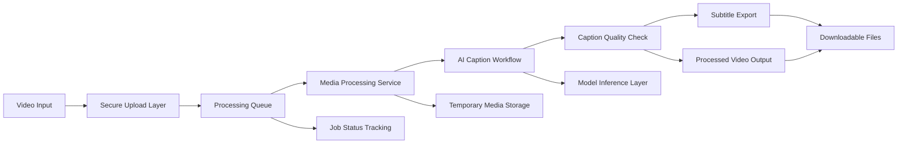

# ClipForger

ClipForger is an AI-assisted video processing platform that converts raw video into caption-ready media through an automated workflow.

This repository is a public portfolio preview. Production source code, model orchestration details, private configuration, and deployment internals are intentionally excluded.

---

## Product Snapshot

- Automated caption generation for uploaded videos
- Timestamp-aware subtitle output
- AI-assisted caption refinement
- Batch-oriented media processing workflow
- Container-ready deployment design

---

## What I Built

- Designed the end-to-end media processing workflow
- Built backend services for video intake and job execution
- Integrated speech-to-text and caption refinement stages
- Created structured subtitle export support
- Organized the system for scalable background processing

---

## Architecture

---

## Features

- Upload-based video processing
- Automatic subtitle generation
- Caption timing support
- Exportable subtitle files
- Background processing workflow
- Deployment-ready container structure

---

## Screenshots

### Upload Interface

### Select Style

### Processing Pipeline

### Caption Editor

### Caption Results

---

## Tech Stack

- Python
- FastAPI
- FFmpeg
- Speech-to-text models
- Docker
- Background workers

---

## Repository Note

This public repository is intended for resume and portfolio review only.

It does not include:

- Production source code
- Model routing logic
- Prompting or refinement strategy
- Infrastructure configuration
- Private datasets
- Secrets or environment files
- Internal worker implementation details

For a deeper technical walkthrough, I can discuss architecture, tradeoffs, and implementation decisions in an interview setting.
